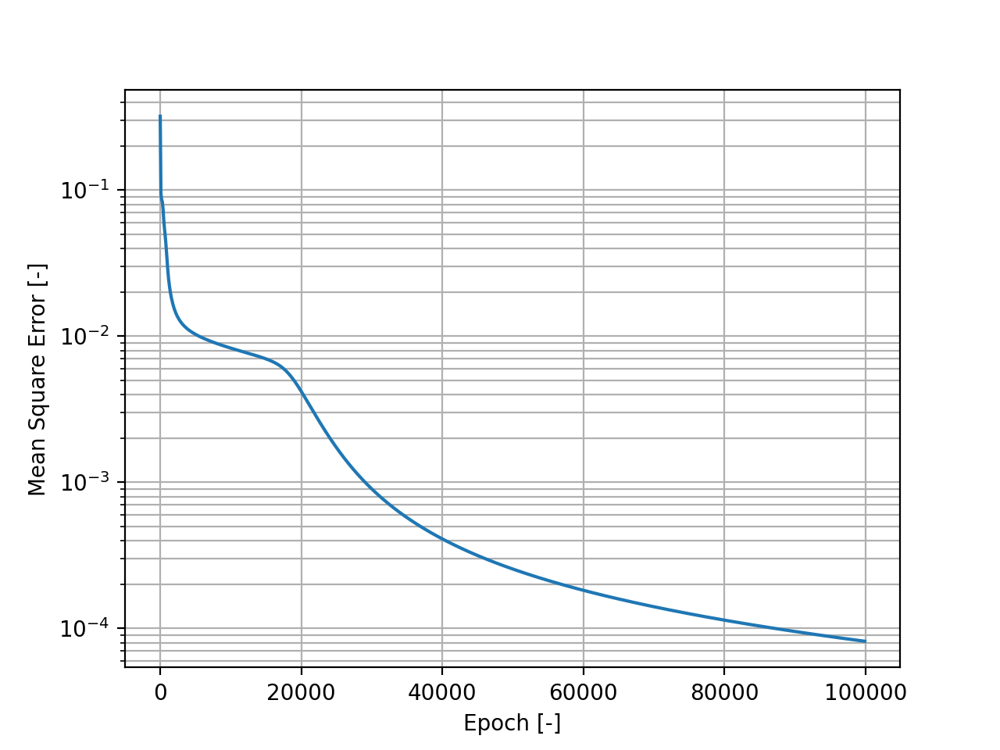

# Binary Classification Neural Network

## Motivation

I really wanted to understand exactly what libraries like tensorflow are doing under the surface. So I wrote my own neural network from scratch. This was a lot easier than expected given the fantastic videos by [Sebastian Lague](https://www.youtube.com/watch?v=hfMk-kjRv4c&t=2249s), [3Blue1Brown](https://www.youtube.com/watch?v=aircAruvnKk&list=PLZHQObOWTQDNU6R1_67000Dx_ZCJB-3pi) and the incredible free online book by [Michael Nielson](http://neuralnetworksanddeeplearning.com).

## Aim

Solve a **very simple** 2-D classification problem using neural networks from scratch using python. The aim was to perform this without any additional libraries for machine learning (tensorflow, pytorch etc.). An example of the problem is shown below.

The network should classify these points into either 'safe' or 'dangerous' given their x,y training coordinates using machine learning. Testing will pass in unseen coordinates and be able to classify them as either 'safe' or 'dangerous' using the machine learning model.

## Requirements

This was tested using python 3.10.13, NumPy 1.24.3 and matplotlib 3.4.3. Shouldn't need anything else. There is a requirements.txt if you need it.

## Results

There is a pretty good convergence of the MSE which could definitely be improved by SGD

Gives 100% test accuracy after the default number of epochs.

## Next steps

This is so basic it could really do with 1000 things doing to it. SGD, use matrices to process all samples in one pass, different activation functions, different cost functions, add momentum to gradient descent, mpi or gpu accleration... THE LIST GOES ON. I kind of want to do something else now this works though.

